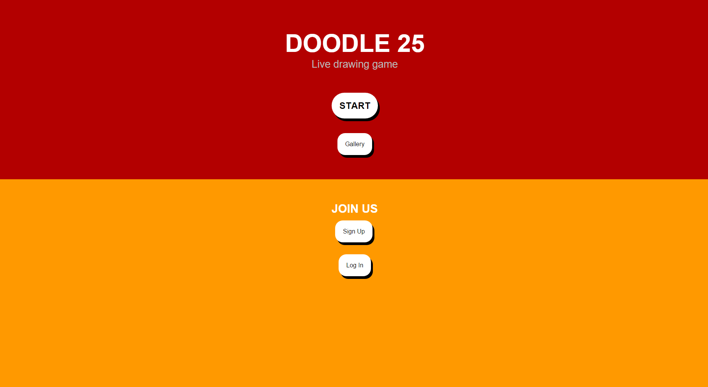
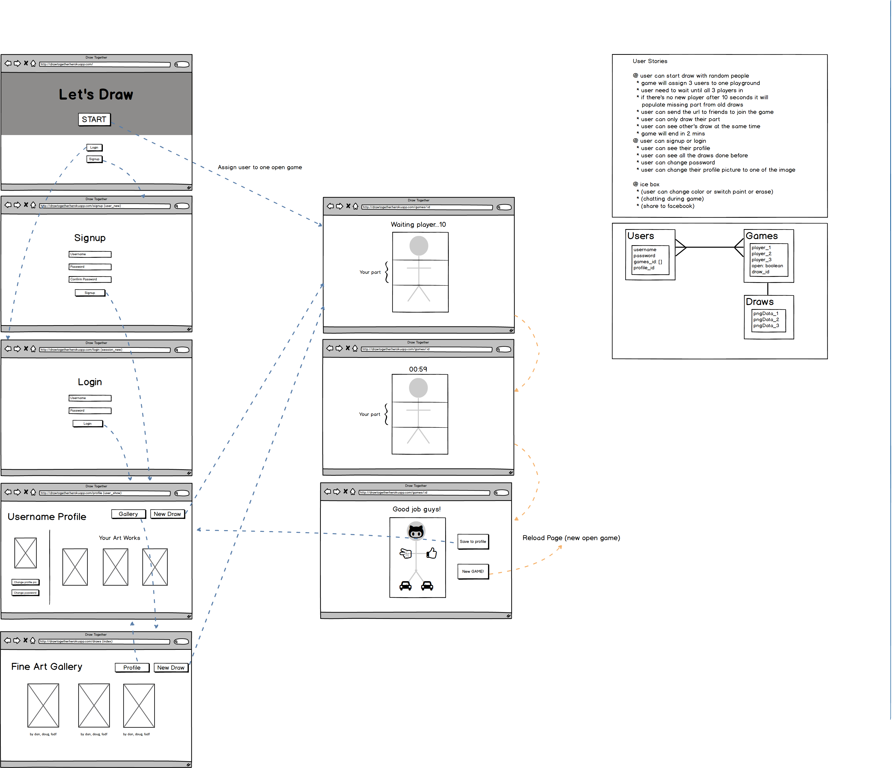

# DOODLE 25
## a live drawing game
Doodle 25 is a web game application. Drawing on the page and all players can see your move real-time. All the art works will be save to database. It's easy to play and have fun with friends!

## Screenshot

## Wireframes

## Technologies
- Languages
  - JavaScript
  - HTML5
  - CSS3

- External Libraries/Frameworks
  - express
  - express-session
  - handlebars
  - mongoose
  - mongoose-deep-populate
  - passport
  - socket.io

- Database
  - MondoDB

## Future Development
- Full functions on socket.io such as join, emit, and broadcast.
- Implement HTML5 canvas for drawing.
- User authorization routes.

## Install
- npm install
- bower install
- mongod (if don't have mongo in background)
- node server.js

## Heroku
<a href="https://doodle25.herokuapp.com/" target="_blank">DOODLE 25</a>

## LinkedIn
 <a href="https://www.linkedin.com/in/danielxji6" target="_blank">Daniel Lwo</a>
